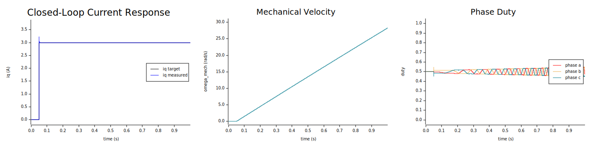
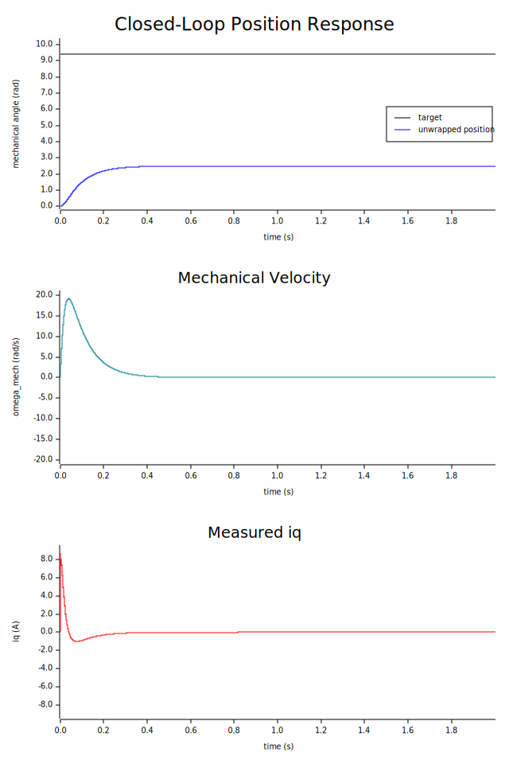
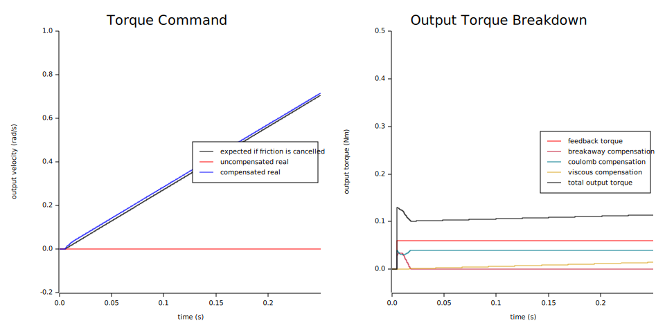
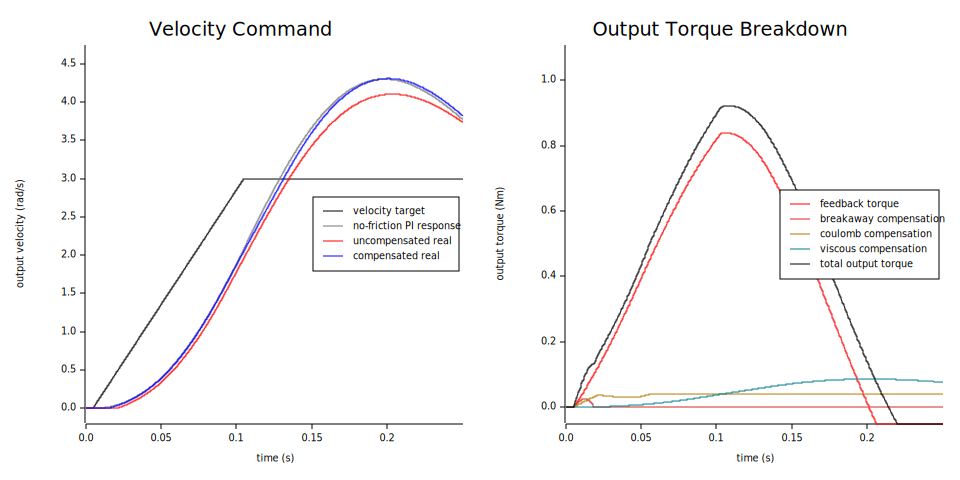
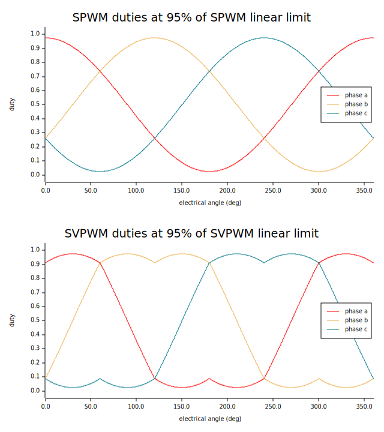

# Fluxkit

`fluxkit` is a `no_std` Rust workspace for BLDC / PMSM projects that want:

- a pure deterministic control core
- a small hardware abstraction surface
- a practical top-level crate for calibration and runtime bring-up
- simulator-backed integration tests before touching hardware

The current project direction is intentionally pragmatic. Fluxkit is aimed at
real motor projects that have:

- absolute rotor sensing
- explicit output/actuator sensing
- a fixed-period control interrupt
- a main-context bring-up flow that calibrates first and then runs closed-loop control

It is not trying to be a generic embedded framework, RTOS, or executor. The
top-level crate is focused on the motor-control problem itself.

## What You Build With It

The intended user flow is:

1. Define your board-specific HAL implementations for:
   - phase PWM
   - current sampling
   - bus voltage sensing
   - rotor sensing
   - output sensing
2. Run motor electrical calibration.
3. Run actuator calibration.
4. Build `MotorParams` and `ActuatorParams` from the resulting calibrated values.
5. Construct `MotorSystem`.
6. In your fixed-period control interrupt, call `tick()`.
7. From non-IRQ code, use `MotorHandle` to:
   - set commands
   - arm/disarm
   - inspect status
   - clear faults

If you want one concrete starting point, use:

```bash
XDG_CACHE_HOME=/tmp/fluxkit-nix-cache nix develop -c cargo run -p fluxkit --example threaded_bringup
```

That example demonstrates the full intended bring-up path:

- motor calibration
- actuator calibration
- handoff into runtime velocity control
- two long-lived contexts:
  - main context
  - IRQ context
- `critical-section`-style shared state and mailboxes

## Workspace Layout

- `crates/fluxkit_math`
  - units, transforms, modulation, PI primitives, estimators
- `crates/fluxkit_core`
  - pure deterministic motor-control engine
- `crates/fluxkit_hal`
  - narrow hardware trait contracts
- `crates/fluxkit`
  - user-facing runtime and calibration crate
- `crates/fluxkit_pmsm_sim`
  - ideal PMSM plant emulator for integration tests and examples

The dependency split is intentional:

- `fluxkit_core` does not depend on the HAL
- `fluxkit_hal` does not depend on the controller
- `fluxkit` is where controller/HAL glue lives
- `fluxkit_pmsm_sim` stays independent from runtime glue

## Current Project Scope

Implemented and usable today:

- `Current`, `Torque`, `Velocity`, `Position`, and `OpenLoopVoltage` control modes
- output-axis control targets with actuator-side compensation
- absolute-encoder rotor sensing
- explicit output-axis sensing
- request-driven motor and actuator calibration systems
- IRQ-oriented runtime wrapper through `MotorSystem::tick()`
- shared command/status surface through `MotorHandle`
- simulator-backed integration tests for calibration and runtime behavior

Not in scope today:

- sensorless control
- hall-sensor abstraction
- startup state machines
- MCU-specific executors or board frameworks
- Embassy-specific runtime integration in the library surface

## Real Usage Model

### Runtime

`fluxkit::MotorSystem` is the project-facing runtime owner.

It owns:

- hardware handles
- controller
- rotor estimator
- output estimator

Each call to `tick()` performs one full fixed-period control step:

- sample hardware
- update estimators
- run controller fast work
- run controller supervisory work
- apply PWM duty
- publish status

Non-IRQ code interacts through `MotorHandle`, not by mutating the controller
directly.

### Calibration

Calibration is also fixed-period and intended to fit the same main-context /
IRQ-context ownership model.

Use:

- `MotorCalibrationSystem`
- `ActuatorCalibrationSystem`

Both are request-driven:

- supply known values as `Some(...)`
- leave values to be calibrated as `None`

Both expose:

- `tick()`
- `phase()`

and return final resolved results:

- `MotorCalibrationResult`
- `ActuatorCalibrationResult`

The normal bring-up order is:

1. `MotorCalibrationSystem`
2. `ActuatorCalibrationSystem`
3. `MotorSystem`

## Examples

### Full Bring-up

```bash
XDG_CACHE_HOME=/tmp/fluxkit-nix-cache nix develop -c cargo run -p fluxkit --example threaded_bringup
```

This is the main project example. It shows:

- `StaticCell`-backed shared state
- long-lived main-context and IRQ-context threads
- IRQ-only ticking of the active system
- main-context construction and phase transitions
- velocity-runtime handoff after calibration

It also writes:

- `target/plots/threaded_bringup_output_velocity.svg`

### Simulator Response Examples

```bash
XDG_CACHE_HOME=/tmp/fluxkit-nix-cache nix develop -c cargo run -p fluxkit-pmsm-sim --example closed_loop_current
XDG_CACHE_HOME=/tmp/fluxkit-nix-cache nix develop -c cargo run -p fluxkit-pmsm-sim --example closed_loop_position
XDG_CACHE_HOME=/tmp/fluxkit-nix-cache nix develop -c cargo run -p fluxkit-pmsm-sim --example closed_loop_torque_command
XDG_CACHE_HOME=/tmp/fluxkit-nix-cache nix develop -c cargo run -p fluxkit-pmsm-sim --example closed_loop_velocity_command
```

These generate SVG plots in `target/plots/`.

Reference outputs:









### Modulation Plot

```bash
XDG_CACHE_HOME=/tmp/fluxkit-nix-cache nix develop -c cargo run -p fluxkit_math --example plot_modulation
```

Reference output:



## Calibration Confidence

The in-repo simulator is used to validate the current calibration flow.

Current confidence level:

- pole pairs are recovered exactly
- electrical offset is within about `0.03 rad` in the current setup
- phase inductance and flux linkage are within about `1%`
- Coulomb and viscous friction fits are close
- breakaway and blend-band calibration are usable, but less trustworthy than the motor electrical terms

Treat this as a strong bring-up baseline, not as proof that any specific real
motor or drivetrain will calibrate perfectly without hardware-specific tuning.

## PMSM Simulator

`fluxkit_pmsm_sim` is an allocation-free ideal plant model used for regression
tests and examples.

It models:

- `d/q` electrical dynamics
- electromagnetic torque
- rigid-shaft mechanics
- viscous and static friction
- output-side reduction, inertia, and parasitic load
- optional voltage magnitude limiting

It can be stepped with:

- `d/q` voltage
- `alpha/beta` voltage
- phase voltage
- PWM duty plus DC bus voltage

It is meant for controller validation and integration testing, not inverter
switching simulation.

## Development

This repo includes a Nix flake with a dev shell.

Enter the shell:

```bash
nix develop
```

Recommended cache setting:

```bash
XDG_CACHE_HOME=/tmp/fluxkit-nix-cache nix develop -c cargo test
```

Common commands:

```bash
XDG_CACHE_HOME=/tmp/fluxkit-nix-cache nix develop -c cargo fmt
XDG_CACHE_HOME=/tmp/fluxkit-nix-cache nix develop -c cargo test -p fluxkit-core -p fluxkit-hal -p fluxkit -p fluxkit-pmsm-sim
XDG_CACHE_HOME=/tmp/fluxkit-nix-cache nix develop -c cargo test -p fluxkit
XDG_CACHE_HOME=/tmp/fluxkit-nix-cache nix develop -c cargo doc -p fluxkit --no-deps
```

Coverage:

```bash
./scripts/coverage.sh --summary-only
./scripts/coverage.sh
open target/llvm-cov/html/index.html
```

To refresh checked-in plot images:

```bash
./scripts/generate-doc-plots.sh
```
