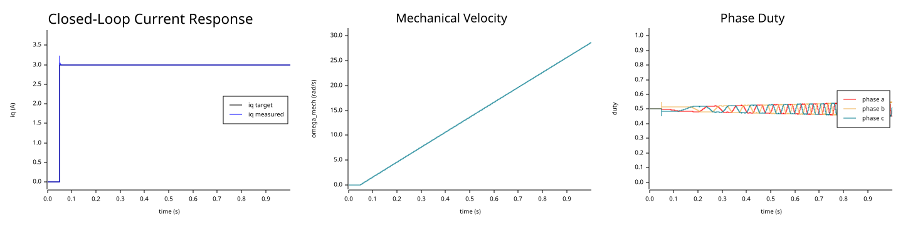
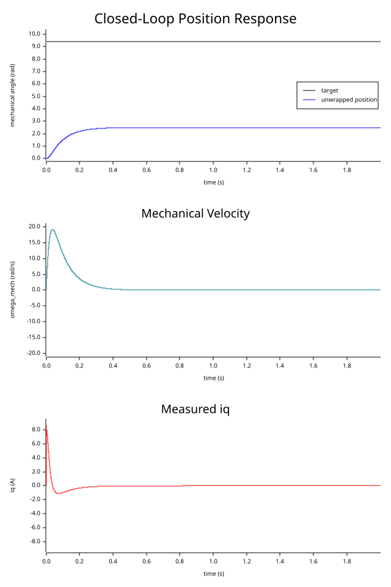
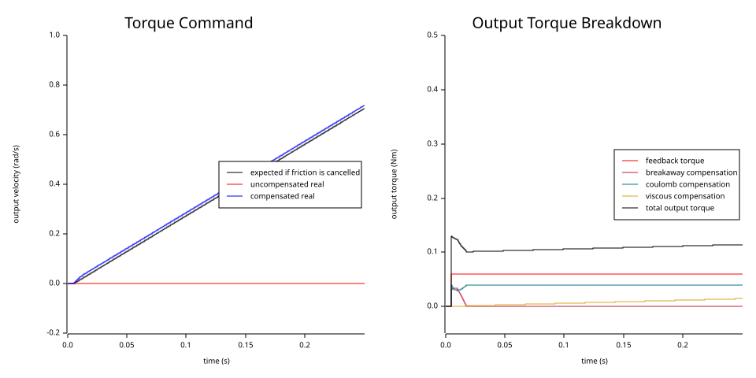
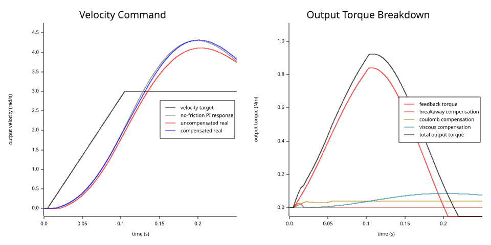

# Fluxkit

[](https://github.com/gmmyung/fluxkit/actions/workflows/ci.yml)
[](https://github.com/gmmyung/fluxkit/actions/workflows/coverage.yml)
[](https://crates.io/crates/fluxkit)
[](https://docs.rs/fluxkit)

`fluxkit` is a `no_std` Rust workspace for BLDC / PMSM projects that want:

- a pure deterministic control core
- a small hardware abstraction surface
- a practical top-level crate for calibration and runtime bring-up
- simulator-backed integration tests before touching hardware

The current project direction is intentionally pragmatic. Fluxkit is aimed at
real motor projects that have:

- absolute rotor sensing
- winding temperature sensing
- explicit output/actuator sensing
- a fixed-period control interrupt
- a main-context bring-up flow that calibrates first and then runs closed-loop control

It is not trying to be a generic embedded framework, RTOS, or executor. The
top-level crate is focused on the motor-control problem itself.

## Published Crates

- `fluxkit` [](https://crates.io/crates/fluxkit) [](https://docs.rs/fluxkit)
- `fluxkit-core` [](https://crates.io/crates/fluxkit-core) [](https://docs.rs/fluxkit-core)
- `fluxkit-hal` [](https://crates.io/crates/fluxkit-hal) [](https://docs.rs/fluxkit-hal)
- `fluxkit_math` [](https://crates.io/crates/fluxkit_math) [](https://docs.rs/fluxkit_math)
- `fluxkit-pmsm-sim` [](https://crates.io/crates/fluxkit-pmsm-sim) [](https://docs.rs/fluxkit-pmsm-sim)
- `as5048a-spi` [](https://crates.io/crates/as5048a-spi) [](https://docs.rs/as5048a-spi)

## Architecture

The workspace is split by responsibility:

- `crates/fluxkit_math`
  - units, transforms, modulation, estimator primitives
- `crates/fluxkit_core`
  - deterministic control engine and pure calibration procedures
- `crates/fluxkit_hal`
  - narrow synchronous hardware contracts
- `crates/fluxkit`
  - project-facing runtime and calibration wrappers
- `crates/fluxkit_pmsm_sim`
  - ideal plant model for tests and examples

The intended ownership model is:

- main/context code owns `MotorRuntime`
- IRQ code executes it through `MotorTicker`
- non-owner code uses `MotorHandle`
- motor and actuator calibration follow the same shape through
  `MotorCalibrationRuntime` / `MotorCalibrationTicker` and
  `ActuatorCalibrationRuntime` / `ActuatorCalibrationTicker`

If you need lower-level controller integration, `fluxkit_core` is still
available, but the normal application path should stay at the `fluxkit` layer.

## What You Build With It

The intended user flow is:

1. Define your board-specific HAL implementations for:
   - phase PWM
   - current sampling
   - bus voltage sensing
   - winding temperature sensing
   - rotor sensing
   - output sensing
2. Run motor electrical calibration.
3. Run actuator calibration.
4. Build `MotorParams` and `ActuatorParams` from the resulting calibrated values.
5. Construct `MotorRuntime`.
6. Create a `MotorTicker` from the runtime owner.
7. In your fixed-period control interrupt, call `ticker.tick()`.
8. From non-IRQ code, use `MotorHandle` to:
   - set commands
   - arm/disarm
   - inspect status
   - clear faults

If you want one concrete starting point, use:

```bash
cargo run -p fluxkit --example threaded_bringup
```

That example demonstrates the full intended bring-up path:

- motor calibration
- actuator calibration
- handoff into runtime velocity control
- two long-lived contexts:
  - main context
  - IRQ context
- `critical-section`-style shared state

The dependency split is intentional:

- `fluxkit_core` does not depend on the HAL
- `fluxkit_hal` does not depend on the controller
- `fluxkit` is where controller/HAL glue lives
- `fluxkit_pmsm_sim` stays independent from runtime glue

## Current Project Scope

Implemented and usable today:

- `Current`, `Torque`, `Velocity`, `Position`, and `OpenLoopVoltage` control modes
- output-axis control targets with actuator-side compensation
- absolute-encoder rotor sensing
- explicit output-axis sensing
- request-driven motor and actuator calibration systems
- owner / handle / ticker runtime wrapper through `MotorRuntime`, `MotorHandle`,
  and `MotorTicker`
- shared command/status surface through `MotorHandle`
- simulator-backed integration tests for calibration and runtime behavior

Not in scope today:

- sensorless control
- hall-sensor abstraction
- startup state machines
- MCU-specific executors or board frameworks
- Embassy-specific runtime integration in the library surface

## Real Usage Model

### Runtime

`fluxkit::MotorRuntime` is the project-facing runtime owner.

It owns:

- hardware handles
- controller
- rotor estimator
- output estimator

The owner creates:

- `handle()`
  - shared command/status access for non-IRQ code
- `ticker()`
  - IRQ-side execution capability
- `try_into_parts()`
  - phase handoff back into owned parts when bring-up moves to another stage

Each call to `ticker.tick()` performs one full fixed-period control step:

- sample hardware
- update estimators
- run controller fast work
- run controller supervisory work
- apply PWM duty
- publish status

Non-IRQ code interacts through `MotorHandle`, not by mutating the controller
directly.

When `try_into_parts()` is used, the owner hands its active runtime back out as
owned parts. Any old handle or ticker derived from that owner becomes inactive
and should be discarded.

### Calibration

Calibration is also fixed-period and intended to fit the same main-context /
IRQ-context ownership model.

Use:

- `MotorCalibrationRuntime`
- `ActuatorCalibrationRuntime`

Both are main-context owners that create:

- `handle()`
  - shared progress/result access
- `ticker()`
  - IRQ-side execution capability
- `try_into_parts()`
  - ownership handoff for the next bring-up phase

Both are request-driven:

- supply known values as `Some(...)`
- leave values to be calibrated as `None`

and return final resolved results:

- `MotorCalibrationResult`
- `ActuatorCalibrationResult`

The normal bring-up order is:

1. `MotorCalibrationRuntime`
2. `ActuatorCalibrationRuntime`
3. `MotorRuntime`

## Examples

### Full Bring-up

```bash
cargo run -p fluxkit --example threaded_bringup
```

This is the main project example. It shows:

- `StaticCell`-backed shared state
- long-lived main-context and IRQ-context threads
- main-context ownership of each active runtime
- IRQ-side ticking through ticker capabilities
- main-context construction, observation, and phase transitions
- velocity-runtime handoff after calibration

It also writes:

- `target/plots/threaded_bringup_output_velocity.svg`

### Simulator Response Examples

```bash
cargo run -p fluxkit-pmsm-sim --example closed_loop_current
cargo run -p fluxkit-pmsm-sim --example closed_loop_position
cargo run -p fluxkit-pmsm-sim --example closed_loop_torque_command
cargo run -p fluxkit-pmsm-sim --example closed_loop_velocity_command
```

These generate SVG plots in `target/plots/`.

Reference outputs:









### Modulation Plot

```bash
cargo run -p fluxkit_math --example plot_modulation
```

Reference output:


## Calibration Confidence

The in-repo simulator is used to validate the current calibration flow.

Current confidence level:

- pole pairs are recovered exactly
- electrical offset is within about `0.03 rad` in the current setup
- phase resistance is normalized to `25°C` from the sampled winding temperature
- phase inductance and flux linkage are within about `1%`
- Coulomb and viscous friction fits are close
- breakaway and blend-band calibration are usable, but less trustworthy than the motor electrical terms

Treat this as a strong bring-up baseline, not as proof that any specific real
motor or drivetrain will calibrate perfectly without hardware-specific tuning.

## PMSM Simulator

`fluxkit_pmsm_sim` is an allocation-free ideal plant model used for regression
tests and examples.

It models:

- `d/q` electrical dynamics
- electromagnetic torque
- rigid-shaft mechanics
- viscous and static friction
- output-side reduction, inertia, and parasitic load
- optional voltage magnitude limiting

It can be stepped with:

- `d/q` voltage
- `alpha/beta` voltage
- phase voltage
- PWM duty plus DC bus voltage

It is meant for controller validation and integration testing, not inverter
switching simulation.

## Development

Use a normal Rust toolchain with `cargo`.

Common commands:

```bash
cargo fmt
cargo test -p fluxkit-core -p fluxkit-hal -p fluxkit -p fluxkit-pmsm-sim
cargo test -p fluxkit
cargo doc -p fluxkit --no-deps
```

Coverage:

```bash
./scripts/coverage.sh --summary-only
./scripts/coverage.sh
open target/llvm-cov/html/index.html
```

To refresh checked-in plot images:

```bash
./scripts/generate-doc-plots.sh
```
