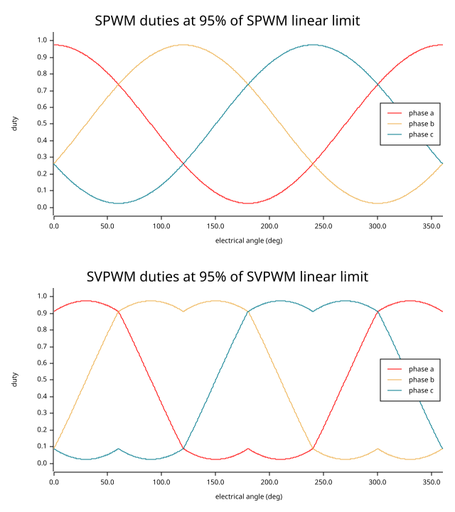

# fluxkit_math

Deterministic `no_std` math primitives for field-oriented control (FOC).

`fluxkit_math` is the convention-locked mathematical foundation for the larger
motor-control stack. It is designed for interrupt-driven embedded control
loops and host-side simulation using the same code paths.

## Conventions

- Clarke transform: amplitude-invariant, balanced three-phase form.
- Park transform: `d` axis aligned with the positive electrical angle.
- Positive `q`: standard PMSM torque-producing direction under the chosen
  Park sign convention.
- Angle wrapping helpers:
  - public wrapped-angle values in the workspace use `[-pi, pi)` by convention
  - [`angle::wrap`] returns angles in `[-pi, pi)`.
- SVPWM duties are normalized to `[0.0, 1.0]`.
- PI anti-windup uses bounded integrator clamping/back-calculation so the
  stored integrator remains consistent with the saturated output.

## Numerical Assumptions

Public APIs are concrete over `f32` in the MVP. Trigonometric and square-root
helpers are isolated in [`trig`] and [`scalar`] and currently use
`micromath`, which keeps the crate usable in `no_std` builds without tying
it to a particular MCU or DSP backend.

## Reference Plot

Phase-duty shape produced by SPWM and SVPWM under comparable operating
points.

